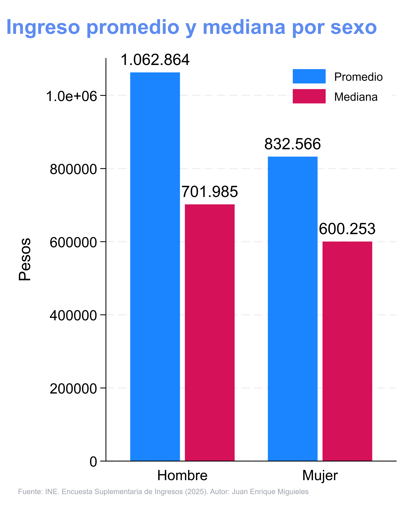

La nueva Encuesta Suplementaria de Ingresos del INE mostró nuevamente que existe una brecha salarial por género.

👇 Aquí tienes una comparación de la mediana de los ingresos líquidos del trabajo principal:

👨‍💼 Hombre: $701.985 pesos

👩‍💼 Mujer: $600.253 pesos

Una diferencia de casi $100.000 pesos al mes.

Y el ingreso promedio mensual para los hombres supera el millón de pesos ($1.062.864), mientras que para las mujeres es considerablemente menor ($832.566). Esta brecha no es solo un número; tiene un impacto real en la vida de las personas y sus familias, afectando la capacidad de ahorro, inversión y calidad de vida.

@economia.y.politicas.publicas

{#fig-promedio_mediana fig-alt="Diferencias en los promedios y en las medianas"}
