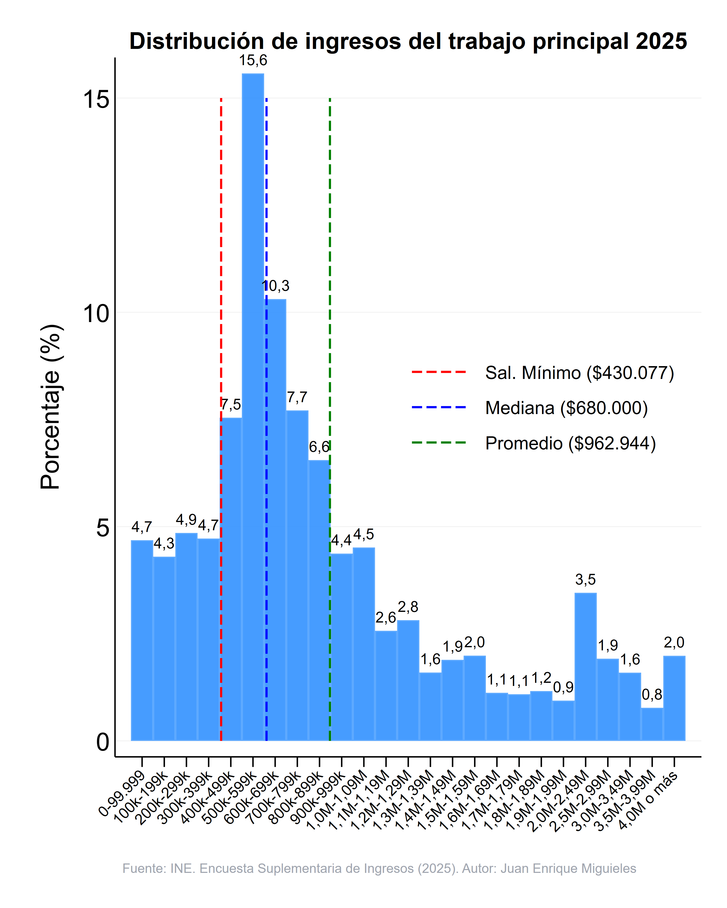

📊 ¿Cuánto ganamos realmente? La radiografía de los sueldos líquidos en Chile (ESI 2025)
Si alguna vez has sentido que las cifras de "sueldo promedio" no representan tu realidad ni la de tus conocidos, no estás solo. Este gráfico basado en la última Encuesta Suplementaria de Ingresos (ESI) del INE nos muestra de forma muy clara cómo se distribuyen los ingresos del trabajo principal en el país.

1. El efecto "Promedio" vs. "Mediana" (La gran brecha). El promedio (media) es de $962.944. La mediana es de $680.000. Esto se explica porque la distribución de ingresos no es simétrica. Existe un grupo relativamente pequeño pero que gana lo suficiente como para aumentar el promedio.

El tramo más común (La punta de la curva). El grupo más grande de trabajadores en Chile se concentra en el tramo de $500.000 a $599.999, representando un 15,6% del total. Si sumamos los tramos adyacentes, una gran mayoría del país vive con ingresos que se mueven estrechamente alrededor del salario mínimo y los $700.000.

La realidad del Salario Mínimo
La línea roja marca el ingreso mínimo de referencia ($430.077). Llama la atención la cantidad de personas (a la izquierda de la línea roja) que perciben ingresos inferiores a este monto, lo que suele explicarse por empleos de jornada parcial, informalidad o subempleo.

Aunque hablar de un sueldo promedio cercano al millón de pesos suena alentador, la realidad estadística (la mediana y la moda) nos muestra que la mitad de Chile trabaja por menos de $680.000 líquidos.

@economia.y.politicas.publicas

{#fig-histograma fig-alt="Histograma Ingresos Chile 2025"}
